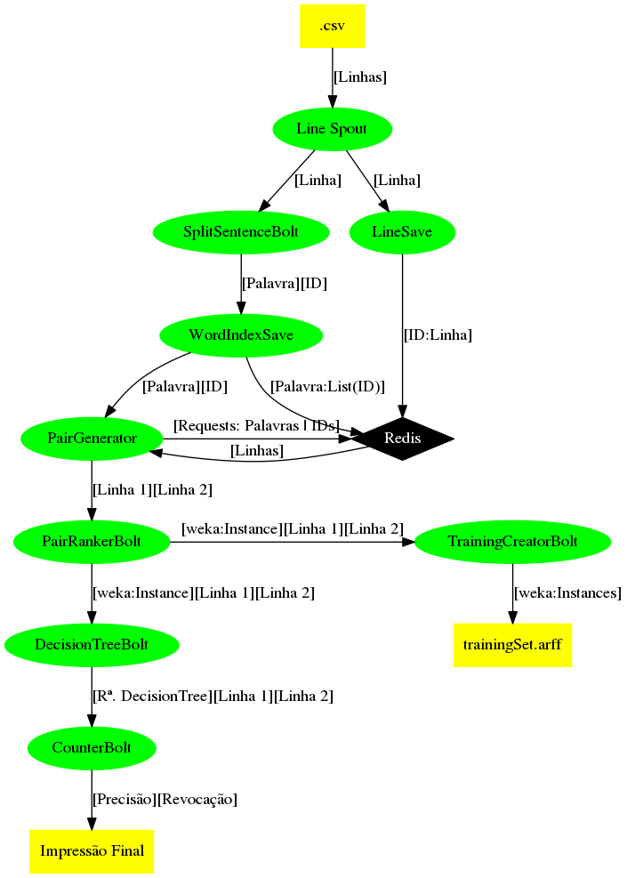

# Blocagem de grandes bases de dados em tempo real

A integração de dados tem como objetivo facilitar o acesso a informações a partir da consolidação de diferentes fontes de dados em um único repositório. Serviços como bibliotecas virtuais, media streaming e redes sociais dependem de um processo de integração com uma alta qualidade. Para isto, uma tarefa fundamental é a identificação de entidades (registros, documentos, textos, etc.) que já estão armazenadas na base de dados, portanto não devem ser novamente inseridas. Tal etapa, conhecida como deduplicação, tem por objetivo melhorar a qualidade das bases de dados, identificando entidades duplicadas. O presente projeto tem como objetivo explorar diretamente a etapa de blocagem para a deduplicação online de grandes bases de dados. A ambição é propor uma nova abordagem para blocagem online capaz de tratar fluxos substanciais de dados sem representar atrasos para o sistema como um todo. Tal demanda será investigada por este projeto com intuito de evoluir o estado da arte das técnicas de blocagem.

# Apache Storm e o processamento de dados em tempo real

O Apache Storm é um sistema de computação distribuído e tolerante a falhas, sendo um software livre, que permite processar dados em tempo real. As soluções do Storm também podem oferecer um processamento de dados garantido, com a capacidade de reproduzir dados que não tenham sido processados com sucesso da primeira vez. O Apache Storm sempre faz com que cada mensagem de entrada seja totalmente processada, mesmo quando a análise de dados é difundida por centenas de nós.
Para mais informações a respeito da utilização e funcionamento do Storm, clique [aqui](http://storm.apache.org/).

# Fluxograma

Abaixo, disponibilizamos o fluxograma inicial da topologia atual utilizada no projeto. Por estar em desenvolvimento, alterações podem ser feitas na imagem até a conclusão da pesquisa.

.
